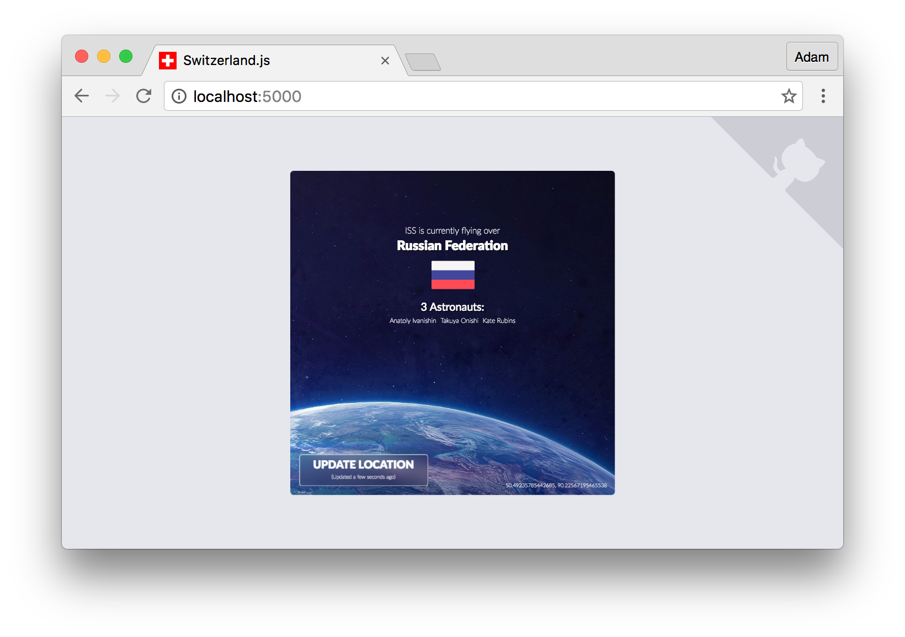

> Switzerland is an experiment in the realm of Web Components through the use of native browser features with a [~4kb core](https://github.com/Wildhoney/Switzerland/blob/master/src/switzerland.js). Use [middleware](https://github.com/Wildhoney/Switzerland/tree/master/src/middleware) to apply behaviours to your components, such as [setState/state](https://github.com/Wildhoney/Switzerland/blob/master/src/middleware/state.js), [Redux](https://github.com/Wildhoney/Switzerland/blob/master/src/middleware/redux.js), mobx. Created with interoperability in mind using Custom Elements, allowing components to be embedded into vanilla, React, Vue, Angular apps with ease. Style encapsulation by default using Shadow DOM.

`npm install switzerland --save`


&nbsp;

&nbsp;




---

## Table of Contents

1. [Advantages](#advantages)
2. [Browser Support](#browser-support)
3. [Getting Started](#getting-started)
  1. [Via Attributes](#via-attributes)
  2. [Using State](#using-state)
  3. [Fetching Data](#fetching-data)
  4. [Redux Migration](#redux-migration)
  5. [Element Methods](#element-methods)
  6. [Sending Events](#sending-events)
  7. [Prop Validation](#prop-validation)
  8. [Applying Styles](#applying-styles)
  
## Advantages

- [x] Uses [native concepts](https://www.w3.org/TR/custom-elements/) which results in performance and bandwidth gains.
- [x] Components are created using functional `pipe` or `compose` meaning you already know Switzerland.
- [x] All behaviours are applied using lightweight middleware, allowing for the creation of custom middleware.
- [x] As [Switzerland is tiny](https://github.com/Wildhoney/Switzerland/blob/master/src/switzerland.js) there's no esoteric black magic happening behind the scenes.
- [x] Templates are created using [`virtual-dom`](https://github.com/Matt-Esch/virtual-dom) which you're already familiar with.
- [x] Components can be transported anywhere, including vanilla, React, Angular environments.
- [x] Shadow DOM allows for style encapsulation meaning no CSS Modules and/or BEM.
  


## Browser Support


Support is required for [Custom Elements](http://caniuse.com/#feat=custom-elements) and [Shadow DOM](http://caniuse.com/#feat=shadowdom) &mdash; both v0 and v1 implementations are supported by Switzerland.

## Getting Started

Components are typically defined using [`pipe`](http://ramdajs.com/docs/#pipe) or [`compose`](http://ramdajs.com/docs/#compose) depending on preference &mdash; however for the simplest component all you need to pass is the name of the component and its render function, which contains the [JSX](https://facebook.github.io/react/docs/jsx-in-depth.html) or [`virtual-dom/h`](https://github.com/Matt-Esch/virtual-dom#example) markup.

```javascript
import { create, html, element } from 'switzerland';

create('swiss-cheese', html(() => {

    return (
        <ul>
            <li>Swiss</li>
            <li>Feta</li>
            <li>Cheddar</li>
        </ul>
    );

}));
```

> Note: You need to import `element` even for JSX, and JSX will be compiled to `virtual-dom`.

Interestingly due to Switzerland's focus on interoperability you are now able to use `swiss-cheese` as a standard HTML component thanks to [Custom Elements](https://www.w3.org/TR/custom-elements/).

```javascript
const swissCheese = document.createElement('swiss-cheese');
document.body.appendChild(swissCheese);
```

> Note: `swissCheese` has a `render` function which you can invoke to cause a re-render from outside.

### Via Attributes

Needless to say that our static `swiss-cheese` component is fairly uninteresting as it never updates. Switzerland allows you to add behaviours to your components by applying middleware via `pipe` or `compose`. Middleware allows you to incrementally compose an object of `props` to pass into your component.

Let's allow our users to add cheeses to our `swiss-cheese` component by updating the element's attributes &mdash; for this we can either build our own, or use the pre-existing `attrs` middleware.

```javascript
import { create, html, element, pipe, attrs } from 'switzerland';

create('swiss-cheese', pipe(attrs, html(props => {

    const cheeses = props.attrs.cheeses.split(',');

    return (
        <ul>
            {cheeses.map(cheese => {
                return <li>{cheese}</li>
            })}
        </ul>
    );

})));
```

Using HTML directly we can add the `swiss-cheese` component to our document, passing in the expected `cheeses` attribute as a [data attribute](http://html5doctor.com/html5-custom-data-attributes/).

```html
<swiss-cheese data-cheeses="Swiss,Feta,Cheddar"></swiss-cheese>
````

> Note: All attributes are [camelized](https://github.com/domchristie/humps#usage) and prefixes of `data-` will be stripped.

Although the output will be the same as the previous example, our `swiss-cheese` component now takes in and listens for mutations to its attributes &mdash; causing an [efficient re-render](https://github.com/Matt-Esch/virtual-dom) when a mutation occurs.

```javascript
const swissCheese = document.querySelector('swiss-cheese');
const cheeses = swissCheese.getAttribute('data-cheeses');
swissCheese.setAttribute('data-cheeses', `${cheeses},Mozarella`);
```

### Using State

As using attributes isn't the most elegant approach to updating components, we can instead choose to use another state manager &mndash; think [Redux](https://github.com/reactjs/redux), [mobx](https://github.com/mobxjs/mobx), or in the following case the React-esque `setState`/`state` approach.

> Note: Try *fiddling* with the [JSFiddle we've created](https://jsfiddle.net/chs2fnod/) for your convenience!

```javascript
import { create, html, element, pipe, state } from 'switzerland';

const initialState = {
    cheeses: ['Swiss', 'Feta', 'Cheddar']
};

create('swiss-cheese', pipe(state(initialState), html(props => {

    const cheeses = props.state.cheeses;

    return (
        <ul>
        
            {cheeses.map(cheese => {
                return <li>{cheese}</li>
            })}
            
            <li>
                <a onclick={() => props.setState({ cheeses: [...cheeses, 'Mozarella'] })}>
                    Add Mozarella
                </a>
            </li>
            
        </ul>
    );

})));
```

By applying the `state` middleware to the `swiss-cheese` component, we are handed two additional properties added for our `props` &ndash; namely `setState` and `state`. Each **instance of the component** will receive a fresh `state` and thus can be mutated independently regardless on the amount of `swiss-cheese` nodes in the DOM.

## Fetching Data

In the above `setState` example it was assumed that we *knew* the list of cheeses beforehand &ndash; however this is unlikely to be case in the real world. Instead we would pull a list of cheeses from a Cheese API&trade;. In order to do this we'll use the `once` middleware to ensure fetching the cheeses occurs only once.

```javascript
import { create, html, element, pipe, state, once } from 'switzerland';

const initialState = {
    cheeses: []
};

const fetch = once(props => {

    setTimeout(() => {
        props.setState({ cheeses: ['Swiss', 'Feta', 'Cheddar'] });
    }, 250);

});

create('swiss-cheese', pipe(state(initialState), once(fetch), html(props => {

    const cheeses = props.state.cheeses;

    return (
        <ul>

            {cheeses.map(cheese => {
                return <li>{cheese}</li>
            })}

            <li>
                <a onclick={() => props.setState({ cheeses: [...cheeses, 'Mozarella'] })}>
                    Add Mozarella
                </a>
            </li>

        </ul>
    );

})));
```

> Note: We're using `setTimeout` to simulate a 250ms latency for an actual AJAX request.

By wrapping our `fetch` function in the `once` middleware, we can be assured that `fetch` will be invoked only **one per instance** &ndash; thus if we had two `swiss-cheese` nodes in the DOM `fetch` would be invoked twice. It's important to understand the importance of `once` &ndash; without it we'd effectively be creating an infinite loop.

Pay close attention to the fact that `fetch` appears **after** the `state` middleware &ndash; in our example it's immaterial, however when invoking `fetch` we need to ensure that the `state` middleware has given us the required `setState` function on the `props`.

As well as `props` being passed in, you may also return props from the `once` middleware which will be merged into the current set of `props`.

### Redux Migration

While using `state` and `setState` work just fine, the functional approach these days to managing state is via [Redux](https://github.com/reactjs/redux) &ndash; for this we can happily use the tiny `redux` middleware.

> Note: If you're unsure about how Redux works then it's worth [glancing over the docs](http://redux.js.org/).

Assuming we want to keep the same functionality as before, we can simply migrate piece-by-piece until we achieve that.

```javascript
import { create, html, element, pipe, redux } from 'switzerland';

import { createStore, applyMiddleware } from 'redux';
import thunk from 'redux-thunk';

const initialState = {
    cheeses: ['Swiss', 'Feta', 'Cheddar']
};

function cheese(state = initialState, action) {

    switch (action.type) {
        case 'ADD': return { ...state, cheeses: [action.cheese, ...state.cheeses] };
        default:    return state;
    }

}

const store = createStore(cheese, applyMiddleware(thunk));

create('swiss-cheese', pipe(redux(store), html(props => {

    return (
        <ul>
        
            {props.redux.cheeses.map(cheese => {
                return <li>{cheese}</li>
            })}
            
            <li>
                <a onclick={() => props.dispatch({ type: 'ADD', cheese: 'Mozarella' })}>
                    Add Mozarella
                </a>
            </li>
            
        </ul>
    );

})));
```

For the most part the above example is largely Redux boilerplate &ndash; the actual integration with Switzerland occurs in the `redux` middleware which takes the store instance created by Redux's `createStore`. Whenever an event is dispatched &mdash; in our case adding Mozarella &mdash; the `swiss-cheese` component is re-rendered.

It's worth noting that the `redux` middleware accepts an *optional* second argument which functions like React's `shouldComponentUpdate` to avoid reconciling the DOM on `props` that don't affect a component. It passes the updated state as the first argument, followed by the previous state as the second: `state, prevState`. It expects a boolean value to be yielded, where `false` is not to update the component.

### Element Methods

By switching over our `swiss-cheese` component to use Redux we immediately lost the ability to update the `cheeses` from **outside** of the component &ndash; we instead added Mozarella by a node internal to the component's DOM. When we were using the [`attributes` approach](#via-attributes), mutating the `data-cheeses` attribute caused a re-render, which is a common requirement for communication between components and the outside world &mdash; enter the `methods` middleware.

```javascript
import { create, html, element, pipe, redux methods } from 'switzerland';
import { store } from './the-swiss-cheese-store';

const add = props => {
    props.dispatch({ type: 'ADD', cheese: props.args });
};

create('swiss-cheese', pipe(methods({ add }), redux(store), html(props => {

    return (
        <ul>
        
            {props.redux.cheeses.map(cheese => {
                return <li>{cheese}</li>
            })}
            
            <li>
                <a onclick={() => props.dispatch({ type: 'ADD', cheese: 'Mozarella' })}>
                    Add Mozarella
                </a>
            </li>
            
        </ul>
    );

})));
```

> Note: By using the `methods` middleware, the `props` which were used for the current render pass are forwarded to the defined methods.

In the preceding example we added a single method to the `swiss-cheese` component via the `methods` middleware, giving us the ability to add cheeses once have a reference to the node.

```javascript
const swissCheese = document.querySelector('swiss-cheese');
swissCheese.add('Mozarella');
```

### Sending Events

Previously we attached an `add` function to the `HTMLElement.prototype` for our `swiss-cheese` component. However, we may often wish to communicate **from inside our component** to the outside world &ndash; using the simple `events` middleware allows us to achieve just this. It's worth noting that we can easily emit our own events using `props.node.dispatchEvent`.

```javascript
import { create, html, element, pipe, redux, methods, events } from 'switzerland';
import { store } from './the-swiss-cheese-store';

create('swiss-cheese', pipe(events, redux(store), html(props => {

    props.event('all', props.redux.cheeses);

    return (
        <ul>
        
            {props.redux.cheeses.map(cheese => {
                return <li>{cheese}</li>
            })}
            
            <li>
                <a onclick={() => props.dispatch({ type: 'ADD', cheese: 'Mozarella' })}>
                    Add Mozarella
                </a>
            </li>
            
        </ul>
    );

})));
```

> Note: By default events don't cross the shadow boundary unless the event has the `composed: true` option set.

By using the `events` middleware, we gain access to the `event` function in our `props`. In our example, each time our component re-renders an event is dispatched passing all of the current cheeses in the payload &ndash; we then use the native `addEventListener` to listen for these events.

```javascript
const swissCheese = document.querySelector('swiss-cheese');
swissCheese.addEventListener('swiss-cheese/all', e => console.log(e.detail.cheeses));
```

As you'll notice, the `events` middleware automatically prepends the current node name to the event &ndash; if this is undesirable behaviour then you should emit your own events using the `Event/CustomEvent` constructor &ndash; please see the [`events` middleware](https://github.com/Wildhoney/Switzerland/blob/master/src/middleware/events.js) for guidance.

### Prop Validation

Validating props allows you to ensure your components are used correctly &ndash; if you have used React before then prop validation [should already be familiar](https://facebook.github.io/react/docs/reusable-components.html) to you. In Switzerland we can perform prop validation using the `validate` middleware, using the [`prop-types` documentation](https://github.com/aackerman/PropTypes#proptypes) for reference.

In the previous examples we have been referencing `props.redux.cheese` by **assuming** it exists &ndash; however using `validate` we can **assert** that it exists otherwise a warning is thrown.

```javascript
import { create, html, element, pipe, redux, methods, validate } from 'switzerland';
import PropTypes from 'prop-types';
import { store } from './the-swiss-cheese-store';

const propTypes = {
    dispatch: PropTypes.func.isRequired,
    redux: PropTypes.shape({
        cheeses: PropTypes.array.isRequired
    }).isRequired
};

create('swiss-cheese', pipe(redux(store), validate(propTypes), html(props => {

    return (
        <ul>
        
            {props.redux.cheeses.map(cheese => {
                return <li>{cheese}</li>
            })}
            
            <li>
                <a onclick={() => props.dispatch({ type: 'ADD', cheese: 'Mozarella' })}>
                    Add Mozarella
                </a>
            </li>
            
        </ul>
    );

})));
```

> Note: Prop validation **only** works when `NODE_ENV=development` to improve production performance.

As we're using `pipe` to construct our component it matters where we place the `validate` middleware, since we need to ensure the `redux` middleware has added the store props before asserting that they exist. We have asserted that **both** `redux.cheeses` and `dispatch` exist in the component's props, which offers us a certain amount of confidence that our component will behave as expected.

### Applying Styles

Now that we have a functioning `swiss-cheese` component, the next logical step would be applying styles to the component. Switzerland supports attaching CSS and JS files to the component by using the `include` middleware.

```javascript
import { create, html, element, pipe, redux, include, path } from 'switzerland';
import { store } from './the-swiss-cheese-store';

create('swiss-cheese', pipe(redux(store), include(path('css/swiss-cheese.css')), html(props => {

    return (
        <ul>
        
            {props.redux.cheeses.map(cheese => {
                return <li>{cheese}</li>
            })}
            
            <li>
                <a onclick={() => props.dispatch({ type: 'ADD', cheese: 'Mozarella' })}>
                    Add Mozarella
                </a>
            </li>
            
        </ul>
    );

})));
```

> Note: Relative paths in the CSS document are retained out-of-the-box.

Once the component is mounted in the DOM, the attached CSS document will be fetched and loaded into the **shadow boundary** of our `swiss-cheese` component, and thus inherit Web Component's enviable [style encapsulation](http://www.html5rocks.com/en/tutorials/webcomponents/shadowdom-201/#toc-style-scoped).

```css
:host {
    display: block;
    background: yellow url('../images/cheese.png');
    border-radius: 3px;
    font-size: 8rem;
}
```

During the fetching phase, the **host component** &mdash; `swiss-cheese` &mdash; will have a class name of `resolving`, whereas after **all** files have been downloaded and attached, the `resolving` class name will be replaced with `resolved` &ndash; this allows you to apply clever behaviour, such as hiding the component until the styles have been applied.

```html
<swiss-cheese class="resolving">
    <!-- ... -->
</swiss-cheese>
```

You may also have noticed that instead of declaring the absolute path to `swiss-cheese.css` which would include the component name and thus break encapsulation, we instead use the `path` function to determine the path of the current component which allows us to handily declare the relative path to the CSS document. It's worth noting that `path` has a `toString` function which simply resolves to the current component's path.
