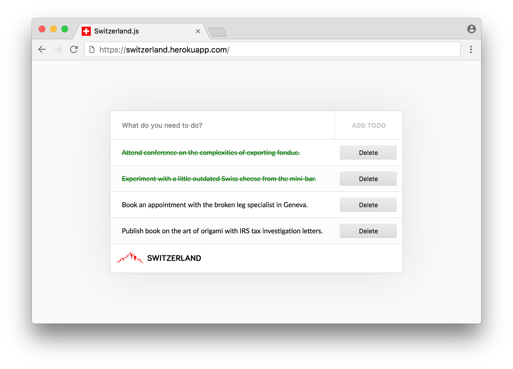

# Switzerland


> Switzerland takes a functional approach to Web Components by applying middleware to your components. Supports Redux, mobx, attribute mutations, CSS variables, React-esque setState/state, etc&hellip; out-of-the-box, along with Shadow DOM for style encapsulation and Custom Elements for interoperability.

`npm install switzerland --save`


&nbsp;

&nbsp;




---

## Motivation

One of the largest downsides to creating components in React, Vue, Ember, etc... is that we re-invent the wheel time-and-time again with every new framework that comes about. Although their components *may* rely on more generic modules, we are still writing components specific to a certain framework, and typically within a certain version range &mdash; if our setup lies otuside of those contraints then we need to continue our search.

For example, if somebody writes a `<mayan-calendar />` component that works nicely with Mayan dates, wouldn't it be nice if we could use that component wherever, irrespective of our chosen framework and version? If there was a `ReactMayanCalendar` that works with React `15.x` then we'd be out of luck if our setup was Ember based &mdash; or React `16.x` based.

Thankfully by utilising custom elements which are native to the browser, we can write interoperable components that can be used **anywhere** &mdash; on their own or in a framework. In addition we inherit other benefits, such as style encapsulation to prevent cross-contamination, and relative loading of CSS documents and associated images.

## Getting Started

<!-- We highly recommend that you use [the CLI](cli) to create Switzerland components, as all of the file creating and setting up is handled automatically. -->

For the most part, Switzerland uses a `create` function and a limited set of middleware functions for creating isolated components. In the "Getting Started" section we'll be creating a cheeseboard because all Swiss like cheese, right?

We'll create the simplest of components consisting of the `create` function, a tag name for the custom element, and the `html` middleware. All this component does is render HTML when the `<swiss-cheeseboard>` component is mounted in the DOM.

```javascript
import { create, h } from 'switzerland';
import { html } from 'switzerland/middleware';

create('swiss-cheeseboard', html(() => {
    return <section class="cheeseboard" />;
}));
```

> We need to import [`h`](https://github.com/picodom/picodom/blob/master/src/h.js) because that's what the virtual DOM transpiles to: `h.div`, `h.time`, etc...

Although any respectable cheeseboard is decorated with delicious cheese, which we would supply via the attributes of the `<swiss-cheeseboard />` element. We need to apply the `attrs` middleware which reads the node's attributes, and watches for any mutations, causing an efficient re-render of the component [using DOM diffing](https://github.com/picodom/picodom).

```javascript
import { create, h } from 'switzerland';
import { html, attrs } from 'switzerland/middleware';

create('swiss-cheeseboard', attrs(), html(props => {

    return (
        <section class="cheeseboard">

            <ul>
                {props.attrs.list.split(',').map(cheese => {
                    return <li>{cheese}</li>;
                })}
            </ul>

        </section>
    );

}));
```

> It's worth noting that middleware is compose left-to-right, similar to Ramda's `pipe` function.

Each middleware should take `props` and return `props` that it may or may not augment. Middleware can also be asynchronous, cancel the processing of the middleware, and throw errors. With the `attrs` middleware, it augments the `props` object with the node's attributes which we need to supply when mounting it to the DOM:

```html
<swiss-cheeseboard list="Gruyere,Cheddar,Emmentaler"></swiss-cheeseboard>
```

As HTML attributes are purely string based, we supply the list of cheese as comma-separated values, but frameworks such as React can supply attributes as arrays, objects, symbols, etc... which `Switzerland` components are more than happy to accept. Nevertheless, the passing of non-string based attributes is non-standard, and as such depends on your individual setup. When writing components it's a good idea to support standard behaviour, and non-standard behaviour when possible. In our case we could have used `Array.isArray` to check whether the `list` attribute was passed as a string or an array.

In the `html` middleware we split by a comma, and iterate over the three cheeses, outputting each in an `<li />` element.

If we later decided that a slice of Stilton was called for, we could mutate the attribute using whichever approach we preferred, and the component would re-render.

```javascript
const cheeseboard = document.querySelector('swiss-cheeseboard');
const cheeses = cheeseboard.getAttribute('list');
cheeseboard.setAttribute('list', `${cheeses},Stilton`);
```

Nevertheless we may decide that our cheeseboard should be able to manage its own list of cheeses internally, and supply a form for allowing the addition of further cheeses. `Switzerland` supports React-esque `state/setState` out-of-the-box.

```javascript
import { create, h } from 'switzerland';
import { html, state } from 'switzerland/middleware';

create('swiss-cheeseboard', state({ cheeses: [], value: '' }), html(props => {

    return (
        <section class="cheeseboard">

            <ul>
                {props.state.cheeses.map(cheese => {
                    return <li>{cheese}</li>;
                })}
            </ul>

            <input
                type="text"
                oninput={event => props.setState({ value: event.target.value })}
                />

            <button onsubmit={() => props.setState({ cheeses: props.value })}>
                Add Cheese
            </button>

        </form>
    );

}));
```

We can use the `state` middleware which simply takes an initial state when invoked, and uses that for the first render. Whenever you make subsequent calls of the `render` function, any passed state will be merged with the *current* state. In our case we're setting the value when it's typed, and then once the button's clicked we're augmenting the `cheeses` array.

## Using Slots

Slots are a [native implementation for Shadow DOM](https://developers.google.com/web/fundamentals/architecture/building-components/shadowdom#slots) that `Switzerland` supports. They allow for the passing of data into the shadow boundary &mdash; for example in React you have `this.props.children` which is akin to a default `<slot />`.

We're going to create a profile card for the beautiful array of cheeses that exist in the world. However, we don't wish to create a profile card for *each* cheese, rather we'd like to pass in certain variables. For this we could pass the variables through DOM attributes, but in our case we're going to be passing an image as well as a name.

We can setup our component in the usual fashion by using the `create` function coupled with the `html` middleware. The wonderful part about using `<slot />`s is that it doesn't require any additional middleware, and so doesn't take up extra bytes in your component.

```javascript
import { create, path, h } from 'switzerland';
import { html } from 'switzerland/middleware';

create('cheese-card', html(props => {

    return (
        <section class="cheese-card">

            <h1>Cheese Profile</h1>

            <slot>
                
                <h2>&mdash;</h2>
            </slot>

            <a href="#">Read more about cheeses on our website</a>.

        </section>
    );

}));
```

As you can see, our component doesn't really do a whole lot, however it is using a single `<slot />` that by default renders a placeholder image using the relative path to the component, and an em-dash for the cheese's name. We're essentially asking the developer who uses the component to pass in some HTML to render into the slot.

In the HTML we'd pass in a single slot that holds both the `` and `<h2 />` tags.

```html
<cheese-card>
    <div>
        
        <h2>Cheddar</h2>
    </div>
</cheese-card>
```

Alternatively we could have asked for two separate slots to be passed in: `image` and `name` which we'd have named `<slot name="image" />` and `<slot name="name" />` from within the component. Our HTML for the component would then have changed to render two elements, each with a `slot` attribute that maps to one of two `<slot />` elements in the component.

```html
<cheese-card>
    
    <h2 slot="name">Cheddar</h2>
</cheese-card>
```

One interesting aspect of the slot based approach is that you can easily update their values, and the component will reflect the change **without** actually re-rendering &mdash; this of course saves unnecessary CPU cycles, and is a whole lot more efficient.

Whether you choose to allow a single slot or multple slots depends on the control you'd like over the data passed in. With our `cheese-card` component it makes to use one slot as both the image and the name are side-by-side, however if they were in two different locations then it makes perfect sense to ask two slots to be passed, where the component's creator would have control over the HTML in between the two slot regions.

Naturally `<slot />` nodes can also contain other custom elements, which may themselves use slots.

## Styling Components

One of the greatest benefits of the shadow boundary is style encapsulation &mdash; all styles apply to a particular component, and don't leak out into other areas without any quirky build techniques, such as [CSS Modules](https://github.com/css-modules/css-modules) which means developers can use `Switzerland` components irrespective of their build process.

In styling components we use the `include` middleware &mdash; you specify the path to the CSS document relative to the component file. All paths specified within the CSS file are relative to the CSS document itself.

```javascript
import { create, h } from 'switzerland';
import { html, attrs, include } from 'switzerland/middleware';

create('cheese-card', attrs(), include('../css/cheese-card.css'), html(props => {

    return (
        <section class="cheeseboard">

            <ul>
                {props.attrs.list.split(',').map(cheese => {
                    return <li>{cheese}</li>;
                })}
            </ul>

        </section>
    );

}));
```

Helpfully the `include` middleware can take one or more CSS paths. Also when you create multiple instances of the `cheese-card` component above, only one AJAX request will be made for the CSS document.

## Atomic Resolution

When creating a component with asynchronous middleware, all middleware will need to have been run before the component is considered resolved &mdash; the `resolved` class name will be also added to the component's host element. However if a component hosts other `Switzerland` components then you *may* argue that the parent component is not considered resolved until its child components have been resolved. For such occasions `Switzerland` provides a `wait` middleware that takes a list of nodes to search for, and if found, awaits their resolution before considering the component resolved.

```javascript
import { create, h } from 'switzerland';
import { html, attrs, wait } from 'switzerland/middleware';

create('cheese-card', attrs(), html(props => {

    return (
        <section class="cheeseboard">

            <ul>
                {props.attrs.list.split(',').map(cheese => {
                    return <cheese-item name={cheese} />;
                })}
            </ul>

        </section>
    );

}), wait('cheese-item'));
```

It's worth bearing in mind that if/when the `props.attrs.list.split.length` is zero, no `cheese-item` components are rendered to the DOM. Nevertheless, the `wait` middleware will only *attempt* to find `cheese-item` components, and if none are found, it will happily continue on its merry way to resolving the component.

In most cases, the order of the middleware in `Switzerland` is important, and with the `wait` middleware it is no different. For instance, if we placed the `wait` middleware **before** the `html` middleware then we wouldn't stand a cat in hell's chance of hoping to find any `cheese-item` nodes, and thus its addition to the middleware chain would be entirely useless. By adding it after the `html` middleware we can be sure that **sometimes** one or more `cheese-item`s will be found.

As you can specify multiple `html` middleware items in the middleware chain, likewise you can specify multiple `wait` middleware items. In that sense, the middleware chain acts like a long `Promise` chain &mdash; `.then(a).then(b).then(c)`.

## Interspersed Rendering

As the `html` middleware is responsible for **all** of the rendering of Switzerland components, you can place as many as you wish in the chain. For example, you may have a chain that is `fetch -> render` where if `fetch` takes a while to complete, the component will have a noticeable lag when it comes to re-rendering. Instead you can prepend `html` which will display a loading screen upon each re-render &ndash; although it won't show up on the first render if you're using the `resolved` class name to toggle its visibility as that technique awaits the completion of **all** middleware before attaching the class name. Now you have a slightly longer chain with: `loading -> fetch -> render`.

```javascript
import { create, h } from 'switzerland';
import { html, wait } from 'switzerland/middleware';
import { fetch } from './the-cheese-api';

const loading = props => {
    return <p>Loading...</p>;
};

create('cheese-card', html(loading), fetch, html(props => {

    return (
        <section class="cheeseboard">

            <ul>
                {props.cheeses.map(cheese => {
                    return <cheese-item name={cheese} />;
                })}
            </ul>

        </section>
    );

}), wait('cheese-item'));
```

Upon each re-render the `loading` function will be invoked which will render the loading message, followed by the `fetch` function which performs an asynchronous request to fetch cheeses, finally followed by the second `html` middleware which renders the list of cheeses.

## Catching Errors

You can think of the `rescue` middleware as React's [`componentDidCatch`](https://reactjs.org/blog/2017/07/26/error-handling-in-react-16.html), although the `rescue` middleware accepts a JSX tree that will be rendered into the component's host node whenever an uncaught error is thrown. Recovery is possible from the `rescue` middleware by invoking the `render` method again &ndash; optionally passing in props that describe the error and/or recovery. This allows for techniques such as a `<button />` to retry the action.

In our case perhaps the cheese API sporadically fails, in which case we can load an alternate view and offer the user to retry by clicking the button.

```javascript
import { create, h } from 'switzerland';
import { html, wait, rescue } from 'switzerland/middleware';
import { fetch } from './the-cheese-api';

const error = props => {
    return (
        <span>
            <p>Error: {props.error.message}</p>
            <button onclick={props.render}>Retry</button>
        </span>
    );
};

create('cheese-card', rescue(error), fetch, html(props => {

    return (
        <section class="cheeseboard">

            <ul>
                {props.cheeses.map(cheese => {
                    return <cheese-item name={cheese} />;
                })}
            </ul>

        </section>
    );

}), wait('cheese-item'));
```

In the event that the `fetch` middleware fails, the `rescue` will already have registered an error handler because it appears **before** `fetch` in the chain &ndash; offering to retry by clicking on the button. It's worth noting that even if the first render of the component results in an error, the component will **still** be considered resolved.

## Namespacing

Namespaces for custom elements address the problem of having naming collisions. For example, if you have a specialised `<email-form />` component, but a generic third-party module also comes with a `<email-form />` component that you wish to extend, you'll run into a naming collision. Therefore Switzerland supports the idea of namespacing imported modules &ndash; so long as they're created with namespaces in mind, which isn't all that difficult to achieve.

Let's take our `<cheese-card />` component that we may wish to publish &ndash; we're going to make it *namespace-able*. For that we need to modify the `cheese-card` component a little by prepending the `cheese-item` with the underscore (`_`) character. By doing that it lets Switzerland know it's a custom element, and therefore may have a namespare prepended to its name depending on the choice of the developer(s) who are using it.

```javascript
import { create, h } from 'switzerland';
import { html, wait } from 'switzerland/middleware';
import { fetch } from './the-cheese-api';

create('cheese-card', fetch, html(props => {

    return (
        <section class="cheeseboard">

            <ul>
                {props.cheeses.map(cheese => {
                    return <_cheese-item name={cheese} />;
                })}
            </ul>

        </section>
    );

}), wait('_cheese-item'));
```

As you can see, whenever we reference the `<cheese-item />` component we prepend the `_` which Switzerland will transform depending on whether a namespace is currently being used &ndash; otherwise the `_` will simply be stripped which will give us the original `<cheese-item />` element. If the namespace `x` was being used then `<cheese-item />` would become `<x_cheese-item />`.

We also change the `wait` middleware to include the `_` which again will be transformed as aforementioned.

Whenever a developer comes along and utilises our `cheese-card` component, they can optionally provide a `data-namespace` to the included `script` tag.

```html
<script type="text/javascript" src="js/cheese-card" data-namespace="x" async defer></script>
```

The imported elements will then become `<x_cheese-card />` and `<x_cheese-item />` leaving the non-prefixed versions waiting to be created if necessary &ndash; components that are created for your project ideally should not be prefixed &ndash; only when they're shared to other developers.

Another important aspect to remember when supporting namespaces is that the associated styles should **never** refer to the custom elements by their name, instead you should use `:host`, `:host-with-context` and other pseudo-selectors such as `:first-child` if necessary, as you can never guanratee the name of the custom element(s) when used in projects you have zero control over.
